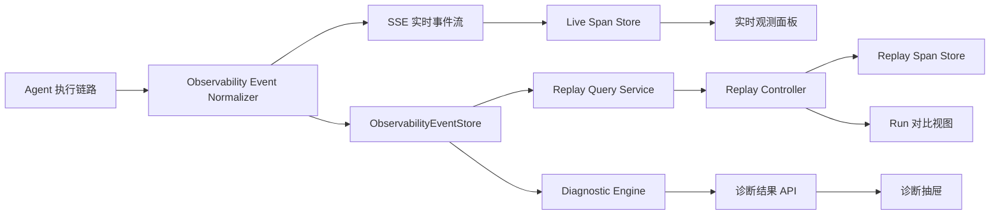

# Agent 链路观测、回放与故障诊断续建实施计划

## 1. 文档目标

本文档基于当前代码与文档状态，给出 Agent 链路观测、回放与故障诊断能力的续建实施计划，重点覆盖仍需完善的三块能力：

- Phase 2：实时观测 MVP
- Phase 5：Replay 控制器与 run 对比
- Phase 4：规则引擎诊断

本文档不包含具体代码实现，主要用于后续拆分任务、确认接口边界、安排迭代顺序和定义验收标准。

## 2. 需求理解

当前系统已经具备观测域的核心基础，但用户侧仍缺少可直接用于排障和复盘的产品化能力。后续建设的目标不是单纯保存更多日志，而是把一次 Agent 执行变成可实时理解、可事后回放、可规则诊断、可对比分析的结构化链路。

核心诉求可以拆成三类：

- 实时观测：运行过程中即可回答“现在执行到哪里、哪个 span 正在跑、工具是否失败、文本流是否中断、路由和上下文是否异常”。
- 回放复盘：对任意已完成 run 按 seq 逐步播放、暂停、快进、定位到 checkpoint，并且回放态不能污染实时态。
- 规则诊断：对高频故障类别用确定性规则产出结构化 issue，并为后续 LLM 辅助诊断保留补充解释入口。

## 3. 当前上下文评估

### 3.1 已有基础

已确认的现有能力：

- `apps/api/src/observability/observability.types.ts`
  - 已冻结 run、span、event、checkpoint、diagnostic issue 等类型。
  - 已预留 `ObservabilityDiagnosticIssue`、诊断分类、严重级别和 evidence 结构。
  - 已包含 route、step、tool、text、checkpoint、error、done 等核心事件类型。

- `apps/api/src/observability/observability.store.ts`
  - 已抽象 `ObservabilityEventStore`，提供 `get`、`list`、`save`、`saveMany`。

- `apps/api/src/observability/prisma-observability-event.store.ts`
  - 已落地 SQLite 表 `observability_events`。
  - 已支持按 run、conversation、agentRun、span、type、status、seq、ts 查询。
  - 已具备 `(run_id, seq)` 唯一约束，可支撑断线补偿和 replay 读取。

- `apps/web/composables/useSpanStore.ts`
  - 已支持 SSE envelope 归一化。
  - 已能维护 span 树、event 列表、checkpoint 索引、active span。
  - 已提供 `replay(envelopes)` 雏形，但仍属于同一个 store 契约，缺少产品级 replay 控制器和状态隔离。

- `apps/web/components/chat/SpanTimelineCard.vue`
  - 已具备基础 span 时间线展示。
  - 已支持 span 点击、hover 和高亮。
  - 当前展示粒度仍偏基础，缺少事件筛选、诊断抽屉、关键事件详情、run replay 控制和 run 对比视图。

- `docs/OBSERVABILITY_REPLAY/AGENT_OBSERVABILITY_REPLAY_IMPLEMENTATION_PLAN.md`
  - 已定义总体实施方向。

- `docs/OBSERVABILITY_REPLAY/PHASE0_DELIVERABLES.md`
  - 已冻结 Phase 0 的核心名词、事件口径、字段边界和保留策略。

### 3.2 当前缺口

主要缺口如下：

- 实时观测 UI 仍然只是基础时间线，无法快速按事件类型、span 类型、异常状态筛选。
- span 树、事件列表、checkpoint、上下文摘要、诊断结果之间缺少联动。
- 后端只有事件持久化 store，缺少 replay 查询服务、诊断执行服务和诊断结果持久化策略。
- `ObservabilityDiagnosticIssue` 只有类型，没有规则执行、去重聚合、异步运行和 UI 展示。
- replay 只有前端 store 的批量重放能力，缺少暂停、单步、快进、定位、速度控制、run diff。
- 回放态与实时态尚未形成明确的状态隔离模型。

## 4. 候选方案

### 4.1 方案 A：实时观测优先，规则诊断并行，Replay 分层补齐

核心思路：

先把当前运行链路做成可用的实时观测面板，同时在后端引入轻量规则引擎，从已存在的事件日志和实时事件流中产出诊断结果。Replay 控制器在事件查询接口稳定后独立实现，并使用独立 replay store，避免污染实时 store。

关键路径：

- Phase 2 先升级前端实时观测面板。
- Phase 4 同步建设纯规则诊断引擎和 issue 输出契约。
- Phase 5 在事件查询 API 稳定后实现 replay controller、checkpoint 定位和 run diff。

涉及文件范围：

- 新增或扩展 `apps/api/src/observability/*diagnostic*`
- 新增或扩展 `apps/api/src/observability/*replay*`
- 扩展 `apps/api/src/observability/observability.types.ts`
- 扩展 `apps/web/composables/useSpanStore.ts`
- 新增 `apps/web/composables/useReplaySpanStore.ts`
- 新增 `apps/web/composables/useObservabilityDiagnostics.ts`
- 扩展 `apps/web/components/chat/SpanTimelineCard.vue`
- 新增实时观测面板、诊断抽屉、replay 控制器、run 对比组件

### 4.2 方案 B：Replay 优先，先做完整复盘闭环

核心思路：

优先建设 replay 查询、播放控制和 checkpoint 定位，使历史 run 具备完整复盘能力，再回头增强实时观测和规则诊断。

关键路径：

- 先做后端 replay 查询 API。
- 前端先实现 replay controller 和 replay store。
- 再补实时 UI 联动和诊断规则。

涉及文件范围：

- 新增 replay API、DTO、service、controller。
- 新增 replay store 和 replay UI。
- 后续再扩展实时观测组件和诊断引擎。

### 4.3 方案 C：后端诊断内核优先，UI 延后

核心思路：

优先把规则引擎、诊断分类、去重聚合和持久化做好，前端先只展示诊断结果摘要。实时观测和 replay 交互延后。

关键路径：

- 先建设诊断规则引擎。
- 先在后端对已落盘事件执行诊断。
- 前端只做 issue 列表，暂不做完整 replay 和联动 UI。

涉及文件范围：

- 新增 diagnostic engine、rules、store。
- 轻量扩展前端诊断列表。
- 后续再做 replay 和实时观测体验。

## 5. 方案对比

| 对比维度 | 方案 A：实时观测优先 | 方案 B：Replay 优先 | 方案 C：诊断内核优先 |
| --- | --- | --- | --- |
| 实现复杂度 | 中。可沿现有 `useSpanStore` 和事件 store 渐进增强 | 高。对历史事件完整性、查询 API、回放 UI 要求较高 | 中。后端清晰，但 UI 价值释放较慢 |
| 与现有代码耦合度 | 中。主要复用现有 span store 和 event store | 高。会更早触碰 API、store、UI 控制器和 checkpoint 语义 | 低到中。主要新增后端模块 |
| 可复用性 / 扩展性 | 高。实时、诊断、replay 共用事件模型 | 高。但前期需要先补齐 replay 抽象 | 中。诊断能力可复用，但链路可视化较弱 |
| 可维护性 | 高。按产品能力分层，边做边校验事件质量 | 中。若事件质量不足，replay 层容易反复返工 | 高。规则内核独立，但与用户排障场景脱节 |
| 性能影响 | 可控。规则引擎异步执行，UI 基于现有流增量更新 | 中。历史 run 查询和重放可能带来批量数据压力 | 可控。规则执行可后台化 |
| 风险等级 | 中。需要协调 UI、store、后端诊断，但风险可分批暴露 | 高。容易被不完整事件日志卡住 | 中。可能先产出“有诊断但不好看链路”的半成品 |

## 6. 推荐方案

推荐采用方案 A：实时观测优先，规则诊断并行，Replay 分层补齐。

推荐理由：

- 与当前系统状态最匹配：前端已有 `useSpanStore` 和基础 `SpanTimelineCard`，后端已有事件 store，适合渐进升级。
- 能最快交付可见价值：先让用户在 run 进行中看清“此刻执行到了哪里”。
- 有助于反向校验事件质量：实时 UI 会最快暴露 seq 缺口、span 归属缺口、done 缺失、tool 事件不闭合等问题。
- Replay 依赖事件完整性，等实时观测和诊断先稳定后再做完整 replay，返工风险更低。
- 规则引擎可以与实时观测并行建设，先产出确定性诊断，后续 LLM 只做补充解释，不改变规则结果。

不推荐方案 B 的原因：

- Replay 对事件完整性要求更高，当前仍缺少产品级实时事件质量校验。
- 如果先做 replay，很容易先把复杂控制器做出来，却发现事件字段不足以支撑复盘体验。

不推荐方案 C 的原因：

- 诊断引擎单独落地能提升后端能力，但用户仍然无法直观看到链路进展。
- 对“实时发现工具失败、链路中断、路由异常、上下文缺失”的目标支撑不够直接。

## 7. 目标架构

续建后的观测系统分为四层：



关键原则：

- 实时态只消费当前 SSE 流和断线补偿事件。
- 回放态只消费 replay query 返回的历史事件快照。
- 诊断引擎可消费实时事件窗口，也可消费已落盘的完整 run 事件。
- checkpoint 只作为定位锚点，不替代完整事件日志。
- LLM 辅助诊断只能补充解释和建议，不覆盖规则引擎的 category、severity 和 evidence。

## 8. 实施路线图

建议按四个迭代推进：

| 迭代 | 重点 | 主要交付 | 依赖 |
| --- | --- | --- | --- |
| Iteration 1 | Phase 2 实时观测 MVP | 实时面板升级、筛选、事件详情、基础诊断抽屉壳 | 已有 `useSpanStore` |
| Iteration 2 | Phase 4 规则引擎 MVP | 规则接口、首批规则、去重聚合、诊断 API | 已有事件 store |
| Iteration 3 | Phase 5 Replay MVP | replay 查询、独立 replay store、播放控制、checkpoint 定位 | 稳定事件查询 |
| Iteration 4 | Run 对比与体验收口 | 双 run diff、诊断与 replay 联动、测试与文档 | Replay MVP |

## 9. Phase 2：实时观测 MVP 实施计划

### 9.1 目标

把基础 span 时间线升级为实时 run 观测面板，能在最终答案完成前判断链路状态。

### 9.2 功能范围

实时观测 MVP 包含：

- run 总览区：runId、状态、开始时间、持续时间、当前 active span、lastSeq。
- 时间线区：按 seq 展示 run、step、tool、text、checkpoint、error。
- span 树区：展示父子结构、状态、耗时、事件数量。
- 事件详情区：点击 span 或 event 后显示 payload 摘要、错误信息、上下文摘要。
- 筛选区：按事件类型、span 类型、状态、是否异常快速筛选。
- 诊断抽屉入口：显示 issue 数、最高严重级别和最新诊断。

### 9.3 关键任务

1. 扩展前端观测状态模型
   - 涉及文件：
     - `apps/web/composables/useSpanStore.ts`
     - `apps/web/composables/useSpanStore.test.ts`
   - 任务：
     - 增加按事件类型、span 类型、状态过滤的派生查询。
     - 增加 span 耗时、事件数量、错误状态、checkpoint 数等计算字段。
     - 保持原始事件不可变，派生字段在 computed 或 selector 中计算。

2. 重构实时观测组件结构
   - 涉及文件：
     - `apps/web/components/chat/SpanTimelineCard.vue`
     - 新增 `apps/web/components/chat/observability/RunOverviewBar.vue`
     - 新增 `apps/web/components/chat/observability/SpanTreePanel.vue`
     - 新增 `apps/web/components/chat/observability/EventTimelinePanel.vue`
     - 新增 `apps/web/components/chat/observability/EventDetailPanel.vue`
   - 任务：
     - 将现有单卡片拆成更清晰的观测工作区。
     - span 树与事件时间线共享选中态。
     - 点击 error/tool/checkpoint 时自动打开事件详情。

3. 增加实时筛选与高亮
   - 涉及文件：
     - 新增 `apps/web/composables/useObservabilityFilters.ts`
   - 任务：
     - 支持事件类型筛选：`run`、`step`、`tool`、`text`、`checkpoint`、`error`。
     - 支持 span 类型筛选：`run`、`step`、`tool`、`text`、`checkpoint`。
     - 支持状态筛选：running、succeeded、failed、canceled。
     - 支持只看异常、只看 active、只看 checkpoint。

4. 接入实时诊断抽屉壳
   - 涉及文件：
     - 新增 `apps/web/components/chat/observability/DiagnosticDrawer.vue`
     - 新增 `apps/web/composables/useObservabilityDiagnostics.ts`
   - 任务：
     - 先接收本地派生的临时 issue 和后端 issue 两种来源。
     - 支持按 severity、category 分组。
     - issue evidence 点击后联动定位事件或 span。

### 9.4 验收标准

- run 执行过程中，UI 能持续更新 active span 和 lastSeq。
- 工具调用失败时，工具 span 标记为 failed，并能直接看到 errorCode、errorMessage、latencyMs。
- 文本流未完成时，text span 保持 running；收到 `assistant_done` 后转为 succeeded。
- 收到 `error`、`canceled` 或缺少 `done` 时，run 状态可以被 UI 明确表达。
- 用户可以按事件类型、span 类型、状态和异常快速筛选。
- 点击诊断 evidence 能定位到对应事件或 span。
- 不依赖最终答案完成即可展示当前执行进度。

## 10. Phase 4：规则引擎诊断实施计划

### 10.1 目标

建设确定性规则引擎，对高频链路故障产出结构化诊断 issue。

### 10.2 规则输出契约

每条规则必须输出：

- `category`
- `severity`
- `title`
- `reason`
- `evidence`
- `suggestion`

其中 `evidence` 必须回指具体事件，至少包含：

- `eventId`
- `type`
- `value`

### 10.3 后端模块设计

建议新增：

- `apps/api/src/observability/diagnostics/observability-diagnostic.types.ts`
- `apps/api/src/observability/diagnostics/observability-diagnostic-rule.ts`
- `apps/api/src/observability/diagnostics/observability-diagnostic.engine.ts`
- `apps/api/src/observability/diagnostics/rules/route.rules.ts`
- `apps/api/src/observability/diagnostics/rules/tool.rules.ts`
- `apps/api/src/observability/diagnostics/rules/context.rules.ts`
- `apps/api/src/observability/diagnostics/rules/stream.rules.ts`
- `apps/api/src/observability/diagnostics/observability-diagnostic.service.ts`
- `apps/api/src/observability/diagnostics/observability-diagnostic.controller.ts`
- `apps/api/src/observability/diagnostics/observability-diagnostic.util.ts`（规则与引擎共用的纯工具，避免循环依赖）

规则引擎接口建议保持纯函数化：

- 输入：`runId`、有序 `events`、可选 `spans`、可选 `checkpoints`。
- 输出：`ObservabilityDiagnosticIssue[]`。
- 约束：规则不得写数据库，不得调用外部 LLM，不得阻塞主链路。

### 10.4 首批规则清单

首批 10 条规则已按下方口径落地，`ruleId` 同时是去重 key 的组成部分（见 10.5）。`severity` 为规则实现的固定值，不再使用“或”表述。

| 类别 | ruleId | 规则 | 触发条件（实现口径） | severity |
| --- | --- | --- | --- | --- |
| `route_misjudgment` | `route_missing` | 路由缺失 | 无 `route_decision`，但存在 `agent.step.started` 或 `tool.call.started`；evidence 挂 start（若有）与首个执行事件 | warning |
| `route_misjudgment` | `route_agent_mismatch` | 路由结果与执行链不匹配 | `route_decision.payload.routeDecision.selectedAgent` 与首个 `agent.step.started.payload.name` 不一致（事件无独立 agent meta，用执行步骤名比对） | warning |
| `tool_failure` | `tool_failure` | 工具失败 | `tool.call.finished` 中 `success=false` 或 `errorCode` 非空 | critical |
| `tool_timeout` | `tool_timeout` | 工具超时 | finished 的 latency 超过阈值；或 `tool.call.started` 无配对 finished 且 run 已有终态事件（避免误报进行中的 run） | critical |
| `tool_failure` | `tool_empty_result` | 工具空结果 | success=true 且 payload 显式存在 `result`/`items`/`output` 字段且为空（预留规则，见下方实现落点） | warning |
| `context_missing` | `context_missing` | 上下文注入缺失 | 事件存在 context 字段（`contextPackId`/`selectedMemoryIds`/`summaryBlocks` 任一）且 `contextPackId` 为空；或 `summaryBlocks` 为空/全部无 memoryId | warning |
| `context_duplicate` | `context_duplicate` | 上下文重复注入 | `selectedMemoryIds` 或 summary block memoryIds 的重复比例 ≥ 阈值（默认 0.5） | warning |
| `context_truncation` | `context_truncation` | 上下文裁剪异常 | `droppedMemoryIds` 非空 且 存在 `truncated=true` 的 summary block | info |
| `stream_interrupt` | `stream_interrupt` | 文本流中断 | 有 `assistant_chunk` 无 `assistant_done`，且 run 终态存在且不是 `done`（完全无终态交给 `stream_incomplete`，二者互斥） | critical |
| `stream_incomplete` | `stream_incomplete` | run 终态缺失 | 有 `start` 但无 `done`/`error`/`canceled` 任一终态 | critical |

#### 10.4.1 实现落点（与代码保持一致）

- 纯函数引擎入口：`apps/api/src/observability/diagnostics/observability-diagnostic.engine.ts`
  - `runObservabilityDiagnostics(runId, events, options?)`：默认规则列表便捷入口。
  - `createDiagnosticEngine(rules?, options?)`：可注入自定义规则与参数。
  - 容错：单条规则抛错时跳过该规则，不影响其余规则与调用方；空事件输入返回 `[]`。
- 规则接口与防御式取值工具：`observability-diagnostic.rule.ts`（缺字段 payload 一律安全取值，不崩溃）。
- 四类规则文件：`rules/route.rules.ts`、`rules/tool.rules.ts`、`rules/context.rules.ts`、`rules/stream.rules.ts`。
- 默认参数：
  - 工具超时阈值 `toolTimeoutMs = 60_000`（毫秒）。
  - 上下文重复比例阈值 `contextDuplicateRatioThreshold = 0.5`。
- `tool_empty_result` 为预留规则：当前 `tool.call.finished` 事件 payload 未携带 result 内容，规则仅在 payload 显式出现 `result`/`items`/`output` 字段时评估；事件字段增强后自动生效，避免误报。
- 未闭合工具判定依赖 run 终态事件；进行中的 run（尚无终态）不判定为超时。
- `stream_interrupt` 与 `stream_incomplete` 互斥：有终态且非 succeeded 归 interrupt；完全无终态归 incomplete。
- 服务与 API：`observability-diagnostic.service.ts`（按 seq 拉取落盘事件后计算）、`observability-diagnostic.controller.ts`（`GET /api/observability/runs/:runId/diagnostics`）。

### 10.5 去重聚合策略

同类诊断必须聚合，避免 UI 被重复 issue 淹没。

建议使用稳定去重 key：

```text
{runId}:{category}:{ruleId}:{spanId || "run"}:{primaryEvidenceEventId}
```

聚合规则：

- 同一工具 span 的多条失败证据合并为一个 issue。
- 同一 run 的 done 缺失只产出一个 issue。
- 同一 context pack 的重复注入只产出一个 issue，evidence 可挂多个事件。
- severity 取同组最高级别。

### 10.6 执行时机

规则执行分三类：

- 实时轻量诊断：前端或后端对当前事件窗口做快速判断，用于即时提醒。
- run 终态诊断：收到 `done`、`error`、`canceled` 后异步执行完整规则。
- 复盘诊断：打开历史 run 或 replay 时，基于落盘事件重新计算或读取已保存结果。

### 10.7 LLM 辅助诊断预留

LLM 辅助诊断作为 Phase 6，不进入本阶段核心闭环，但本阶段需要保留接口边界：

- 输入只能使用规则 issue、事件摘要、span 摘要和脱敏 payload。
- 输出只能补充 `explanation`、`nextActions`、`confidence`。
- 不允许覆盖规则 issue 的 category、severity、evidence。
- LLM 失败不影响规则诊断结果展示。

### 10.8 验收标准

- 每个首批规则都有单元测试覆盖。
- 同类 issue 可去重聚合。
- 规则执行不阻塞 SSE 主链路。
- issue evidence 能回指事件，并可被前端定位。
- 没有触发规则时返回空数组，而不是异常。
- 非法 payload 或缺字段事件不会导致规则引擎崩溃。

## 11. Phase 5：Replay 控制器实施计划

### 11.1 目标

让任意已完成 run 可以按事件顺序复盘，并支持同一问题多次 run 的决策与结果差异对比。

### 11.2 后端 Replay 查询

建议新增：

- `apps/api/src/observability/replay/observability-replay.service.ts`
- `apps/api/src/observability/replay/observability-replay.controller.ts`
- `apps/api/src/observability/replay/dto/observability-run-events-query.dto.ts`
- `apps/api/src/observability/replay/dto/observability-run-replay-response.dto.ts`

核心接口建议：

- `GET /observability/runs/:runId/events`
  - 查询指定 run 的事件列表。
  - 支持 `seqGt`、`seqGte`、`seqLte`、`types`、`limit`。

- `GET /observability/runs/:runId/replay`
  - 返回 replay 所需完整包：events、checkpoints、diagnostics、run summary。

- `GET /observability/conversations/:conversationId/runs`
  - 返回同一会话下可 replay 的 run 列表。

- `GET /observability/runs/compare?leftRunId=&rightRunId=`
  - 返回 run 对比所需摘要，MVP 阶段可先由前端基于两个 replay 包计算。

### 11.3 前端 Replay 状态隔离

必须区分实时态和回放态：

- live store：由当前 SSE 流驱动，只表示当前 run。
- replay store：由历史事件数组驱动，只表示 replay 游标所在状态。
- compare store：由两个 replay snapshot 或 replay package 计算 diff。

建议新增：

- `apps/web/composables/useReplaySpanStore.ts`
- `apps/web/composables/useReplayController.ts`
- `apps/web/components/chat/observability/ReplayControlBar.vue`
- `apps/web/components/chat/observability/ReplayRunPicker.vue`
- `apps/web/components/chat/observability/ReplayDiffPanel.vue`

### 11.4 Replay Controller 能力

MVP 必须支持：

- 单步播放：游标从当前 seq 推进到下一个事件。
- 暂停：停止自动推进。
- 快进：按速度或批量步进推进。
- 定位：跳转到指定 seq。
- checkpoint 定位：跳转到 checkpoint 对应 seq。
- 重置：回到 seq 起点。

Replay 状态建议：

- `mode`: `idle`、`playing`、`paused`、`completed`
- `cursorSeq`
- `speed`
- `selectedCheckpointId`
- `visibleEventTypes`
- `replaySnapshot`

### 11.5 Checkpoint 语义

checkpoint 作为恢复锚点，不替代完整事件日志。

定位流程：

1. 用户选择 checkpoint。
2. replay controller 将 cursor 设置为 checkpoint.seq。
3. replay store 从起点或最近缓存 snapshot 重建到该 seq。
4. UI 展示该 seq 时刻的 span 树、事件列表和诊断状态。

MVP 可以先从起点重放到目标 seq；当历史事件量变大时，再引入 checkpoint snapshot 缓存。

### 11.6 Run 对比 MVP

对比目标是让同一问题的多次 run 能直观看到决策与结果差异。

MVP 对比维度：

- route decision 差异：intent、selectedAgent、confidence。
- tool 调用差异：工具名称、调用次数、成功/失败、耗时。
- context 差异：contextPackId、selectedMemoryIds、droppedMemoryIds、summaryBlocks 数量。
- stream 差异：chunk 数、总字符数、是否正常 done。
- diagnostic 差异：issue 数、最高 severity、category 分布。

建议先做摘要级 diff，不做逐 token 或全文 diff。

### 11.7 验收标准

- 已完成 run 可以按 seq 完整重放。
- replay 播放、暂停、单步、快进、跳 seq、跳 checkpoint 可用。
- replay store 不改变 live store 的 active span、lastSeq 和当前 UI 状态。
- checkpoint 跳转后，span 树与事件列表符合目标 seq 的状态。
- 两个 run 可展示 route、tool、context、stream、diagnostic 的摘要差异。
- 历史事件为空或不完整时，UI 显示可理解的空态或缺失提示。

## 12. 数据与接口补充建议

### 12.1 类型补充

建议在 `ObservabilityDiagnosticIssue` 基础上补充可选字段：

- `ruleId`
- `dedupeKey`
- `updatedAt`
- `occurrenceCount`

如果不想立刻改类型，可先在后端内部类型中维护，最终映射回现有 issue 结构。

### 12.2 事件类型补充

现有事件类型已覆盖 MVP，但为了诊断更清晰，后续可考虑补充：

- `context.pack.created`
- `context.pack.injected`
- `context.pack.truncated`
- `diagnostic.issue.created`

MVP 阶段不建议强制新增事件类型，可以先从现有 payload 中提取 context 信息。

### 12.3 诊断持久化策略

MVP 可先不新建诊断表，采用实时计算或打开 run 时计算。进入稳定阶段后再新增：

- `observability_diagnostic_issues`
- 按 `run_id`、`category`、`severity`、`dedupe_key` 建索引。

推荐节奏：

1. 规则引擎纯计算。
2. replay 打开时按需计算。
3. run 终态后台计算。
4. 结果持久化和增量更新。

## 13. 测试计划

### 13.1 后端测试

新增或扩展：

- `apps/api/src/observability/prisma-observability-event.store.spec.ts`
- `apps/api/src/observability/diagnostics/observability-diagnostic.engine.spec.ts`
- `apps/api/src/observability/diagnostics/rules/*.spec.ts`
- `apps/api/src/observability/replay/observability-replay.service.spec.ts`

覆盖重点：

- 事件查询顺序稳定。
- seq 范围查询正确。
- 规则对缺字段 payload 容错。
- done 缺失、tool 超时、context 缺失等高频规则命中。
- 去重聚合稳定。

### 13.2 前端测试

新增或扩展：

- `apps/web/composables/useSpanStore.test.ts`
- `apps/web/composables/useReplaySpanStore.test.ts`
- `apps/web/composables/useReplayController.test.ts`
- `apps/web/composables/useObservabilityDiagnostics.test.ts`

覆盖重点：

- live ingest 不被 replay 操作污染。
- replay 游标推进后 snapshot 正确。
- checkpoint 跳转正确。
- 筛选组合不破坏事件顺序。
- diagnostic evidence 定位正确。

### 13.3 手工验收场景

至少准备以下样例 run：

- 正常完成：start、route、step、tool、assistant_chunk、assistant_done、done 完整。
- 工具失败：tool finished success=false，最终 run failed 或继续完成。
- 工具超时：tool started 后长时间没有 finished。
- 路由缺失：缺少 route_decision 但进入 step/tool。
- 上下文缺失：没有 contextPackId 或 summaryBlocks 为空。
- 文本中断：有 assistant_chunk 但无 assistant_done。
- done 缺失：有 start 但没有任何终态事件。

## 14. 里程碑拆分

### Milestone 1：实时观测可用

交付：

- 实时 run 总览。
- span 树和事件时间线联动。
- 筛选和事件详情。
- 基础诊断抽屉壳。

完成标准：

- 用户能在 run 进行中判断执行位置和异常状态。

### Milestone 2：规则诊断可用

交付：

- 规则引擎接口。
- 首批四类规则。
- 去重聚合。
- 前端诊断展示和 evidence 定位。

完成标准：

- 高频故障可以稳定产出结构化 issue。

### Milestone 3：Replay 可用

交付：

- replay 查询接口。
- 独立 replay store。
- replay 控制器。
- checkpoint 跳转。

完成标准：

- 任意已完成 run 可以按 seq 复盘。

### Milestone 4：Run 对比可用

交付：

- run picker。
- 双 run 摘要 diff。
- route、tool、context、stream、diagnostic 差异展示。

完成标准：

- 同一问题多次 run 的关键差异可以被直观看到。

## 15. 风险与应对

| 风险 | 表现 | 应对 |
| --- | --- | --- |
| 事件字段不稳定 | UI 无法稳定归类或规则误判 | 保留 legacy 映射层，新增事件质量检查 |
| done 缺失难区分失败与断线 | 误报 stream incomplete | 结合 SSE 连接状态、run 状态和超时窗口判断 |
| replay 数据量过大 | 前端重放卡顿 | MVP 限制单次 run 事件量，后续引入 checkpoint snapshot 缓存 |
| 规则误报过多 | 诊断抽屉噪声大 | 规则分 severity，默认聚合，同类只展示摘要 |
| LLM 诊断覆盖规则结果 | 诊断不可解释 | 明确 LLM 只补充 explanation，不覆盖 evidence |
| 实时态和回放态混用 | 当前运行 UI 被历史 replay 污染 | 强制 live store 与 replay store 分离 |

## 16. 后续实施顺序建议

建议下一步按以下顺序落地：

1. 先补 `useSpanStore` 的筛选、统计和异常派生能力。
2. 拆出实时观测面板组件，完成 Phase 2 MVP。
3. 新增后端规则引擎纯函数内核，先用单元测试驱动四类规则。
4. 把诊断 issue 接入前端诊断抽屉，并完成 evidence 定位。
5. 新增 replay 查询服务和前端 replay controller。
6. 新增独立 replay store，确保不污染 live store。
7. 基于两个 replay package 实现 run 对比 MVP。

这一路线的核心判断是：先把“实时看见链路”做好，再让规则引擎解释问题，最后把稳定事件流用于 replay 和 diff。
