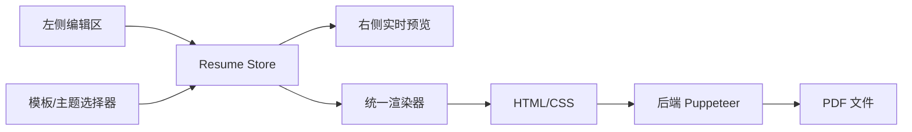

# 简历 PDF 多模板主题系统实施计划书

## 1. 背景

当前 PDF 导出链路已稳定，但样式只有单一固定方案，无法满足用户对模板风格、主题色和预览一致性的需求。

## 2. 方案选择

### 2.1 推荐方案

采用“声明式模板 + 主题 tokens + 共享渲染器”。

### 2.2 不采用 DSL 的原因

- 内置模板场景下，DSL 收益有限
- 解析和校验成本高
- 预览和导出一致性更难保证

## 3. 架构设计



### 3.1 模板层

- 负责页面结构、槽位、页边距、内容顺序
- 每个模板只描述布局，不承载业务逻辑

### 3.2 主题层

- 负责颜色、字体、间距、边框、背景
- 通过 CSS Variables 统一注入

### 3.3 渲染层

- 前端预览与后端导出共用同一份渲染数据
- 避免“双实现”导致的样式偏差

## 4. 数据结构

```ts
interface PdfTemplateDefinition {
  id: string;
  version: string;
  name: string;
  preview: string;
  page: {
    size: "A4";
    margin: { top: string; right: string; bottom: string; left: string };
  };
  layout: {
    columns: 1 | 2;
    sections: Array<{ slot: string; order: number }>;
  };
}

interface PdfThemeDefinition {
  id: string;
  version: string;
  name: string;
  tokens: {
    primary: string;
    secondary: string;
    text: string;
    muted: string;
    border: string;
    background: string;
    fontFamily: string[];
    baseFontSize: number;
  };
}
```

## 5. 实施步骤

### 第 1 步：补数据模型

- 扩展前端状态
- 扩展导出参数
- 保留旧接口兼容

### 第 2 步：实现模板与主题注册表

- 定义内置模板清单
- 定义内置主题清单
- 增加版本号与默认项

### 第 3 步：实现实时预览

- 左侧编辑联动右侧预览
- 切换主题即时重绘
- 增加 debounce 和 loading 状态

### 第 4 步：打通导出

- 预览渲染与导出渲染复用
- 后端生成最终 PDF
- 保持错误码和重试策略

### 第 5 步：测试与验收

- 不同模板/主题组合对比
- 长内容分页测试
- PDF 文件大小和渲染时间测试

## 6. 时间预估

| 工作项             | 预估   |
| ------------------ | ------ |
| 数据模型与接口扩展 | 1 天   |
| 模板/主题注册表    | 1.5 天 |
| 实时预览           | 2 天   |
| 导出链路改造       | 1.5 天 |
| 测试与修复         | 1.5 天 |

总计：约 `7` 天。

## 7. 风险与对策

- 预览与导出不一致：共用渲染器
- 字体加载慢：内置字体并等待加载完成
- 切换卡顿：预览 debounce + 缓存模板资源
- 兼容性问题：保留旧导出参数兜底

## 8. 结论

推荐先落地 3 套模板 + 3 套主题 + 实时预览，再逐步扩展模板数量和自定义能力。
