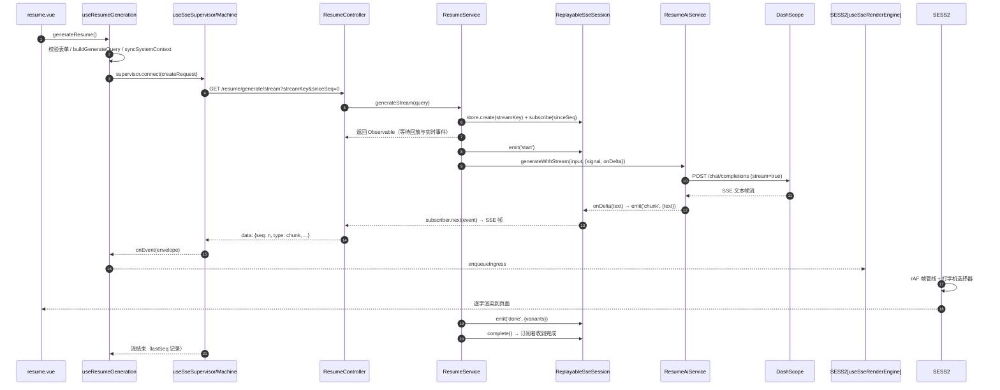
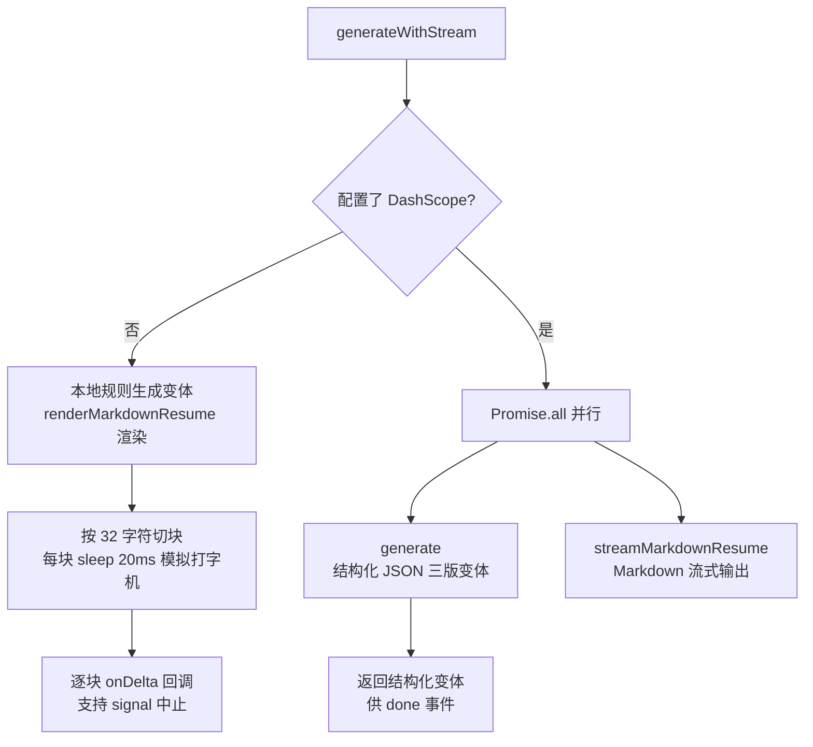

# AI 简历流式生成（SSE）架构文档

> 覆盖范围：前端「生成简历」触发 → `GET /resume/generate/stream`（SSE）→ AI 流式生成 → 打字机渲染的完整链路。

## 1. 概述

简历生成采用 **SSE（Server-Sent Events）+ 可回放会话** 架构，实现三个核心能力：

| 能力 | 机制 |
|---|---|
| 打字机式流式输出 | LLM delta 文本 → `chunk` 事件 → 前端帧渲染管线逐字呈现 |
| 断线续传 | `streamKey` 复用同一条会话 + `sinceSeq` 按序号增量补发 |
| 无 LLM 降级 | 无 DashScope 配置时本地规则生成并模拟分块输出 |

服务端在内存中按 `streamKey` 维护「可回放 SSE 会话」，缓存全量事件；客户端携带 `sinceSeq` 连接，服务端先同步回放缺失事件、再增量推送。

## 2. 架构总览

```mermaid
flowchart LR
    subgraph 前端 apps/web
        A[resume.vue<br/>页面/表单] -->|@generate| B[useResumeGeneration<br/>组合式函数]
        B --> C[useSseSupervisor<br/>重试监督器]
        C --> D[useSseMachine<br/>连接状态机]
        B --> E[useSseRenderEngine<br/>帧渲染引擎]
        E --> F[createTypewriterFrameSelector<br/>打字机选择器]
        B --> G[consumeSseEventEnvelopeStream<br/>SSE 帧解析/seq 去重]
    end

    subgraph 后端 apps/api
        H[ResumeController<br/>@Sse generate/stream]
        I[ResumeService<br/>generateStream 会话编排]
        J[ReplayableSseSessionStore<br/>进程内会话表]
        K[ReplayableSseSession<br/>事件缓存 + 订阅者广播]
        L[SseEnvelopeFactory<br/>seq 信封生成]
        M[ResumeAiService<br/>generateWithStream]
        N[requestDashscope<br/>超时/取消组合]
        O[DashScope 通义千问 API]
    end

    B -->|GET /resume/generate/stream?streamKey&sinceSeq| H
    H --> I
    I -->|create/get| J
    J -->|按 key| K
    K -->|emit 事件| L
    K -->|onDelta 文本| M
    M --> N
    N -->|SSE 流| O
    K -->|回放 + 实时推送| H
    H -->|SSE 帧| B
    B -->|ingress| E
    E -->|逐帧| F
```

## 3. 端到端调用时序



## 4. 事件协议（Envelope）

前后端统一信封结构（`apps/api/src/common/sse.ts` 与 `apps/web/utils/sse.ts` 保持一致）：

```jsonc
{
  "id": "run_xxx:3",          // runId:seq 组合
  "seq": 3,                   // 单调递增序号，续传/去重的依据
  "runId": "run_xxx",         // 任务运行标识
  "spanId": "span_yyy",       // 可选的链路追踪 ID
  "type": "chunk",            // 事件类型
  "ts": "2026-08-10T08:00:00.000Z",
  "payload": { "text": "..." } // 业务负载
}
```

### 简历流事件类型（`apps/web/utils/sse-events.ts`）

| type | 方向 | 用途 |
|---|---|---|
| `start` | 服务端 → 客户端 | 流开始，携带 requestId / taskId / variantCount |
| `progress` | 服务端 → 客户端 | 进度（0-100）+ 阶段（planning / generating / post_processing） |
| `chunk` | 服务端 → 客户端 | 增量文本（打字机素材），携带 variantIndex / field |
| `done` | 服务端 → 客户端 | 终态成功，携带完整 variants 数组 |
| `error` | 服务端 → 客户端 | 终态失败，携带 code / message |
| `canceled` | 服务端 → 客户端 | 终态取消（用户中止 / 空闲超时） |

## 5. 前端架构

### 5.1 页面入口（resume.vue）

- 页面从 `useResumeGeneration` 解构出 `generateResume` 等能力；
- 简历表单组件在用户点击「生成」时派发 `generate` 事件，模板中绑定 `@generate="generateResume"`。

### 5.2 useResumeGeneration（组合式函数核心）

职责：编排「表单校验 → 同步上下文 → 发起流 → 消费事件 → 渲染 → 写会话」。

- `startGenerateStream(query)`：构造 `streamKey` + `sinceSeq` 查询串，发起 SSE GET 请求；
- `consumeResponse`：解析 SSE 帧 → 按 `seq` 去重 → 事件注入渲染引擎；收到 `done` 且变体非空时调用 `seedGeneratedConversation` 把结果写入会话；
- 事件驱动状态：`streamProgress / streamStage / streamPreview / resumeVariants`；
- 已导出 `resumeRenderMonitoring`（渲染引擎压力监控快照）供 UI 展示。

### 5.3 SSE 连接状态机（useSseMachine）

`SseMachine` 维护连接生命周期，合法迁移表：

```
idle → connecting → streaming → done
                       │  │  └─→ error ──→ retrying → connecting
                       │  └─────→ canceled        ↑
                       └─────────→ paused ──→ streaming
```

- 用 `activeRunId` 做竞态保护：旧请求的回调不再影响新状态；
- 内部 `AbortController` 统一管理连接取消；
- `isAbortError` 判定中止错误 → 转为 `canceled` 而非 `error`。

### 5.4 重试监督器（useSseSupervisor）

- 在状态机之上增加**退避重连**：仅对 `SseStreamDisconnectedError`（服务端未发终态事件就断连）重试 1 次；
- 默认退避 `min(30s, 1000ms * 2^(attempt-1))` 且带随机抖动；
- 重试期间可被 `cancel()` 打断（等待期挂起的 `retryResolver` 会被提前 resolve）。

### 5.5 帧渲染引擎（useSseRenderEngine）

基于 `requestAnimationFrame` 的分帧渲染管线，避免高频 chunk 事件导致主线程卡顿：

- **管道**：`ingress 缓冲 → 帧预算内转换 → 帧缓冲 → 逐帧提交渲染`；
- **打字机选择器**：按 `charsPerSecond`（简历流 120 字符/秒）计算每帧字符配额，以**字素簇**粒度切分文本，多余字符累积到下一帧；
- **压力感知**：综合队列深度 / 滞留时长 / 帧耗时 EWMA / 连续积压帧 计算压力分（0-100），高压力下自动降级（缩小帧预算、过滤 decorative 项、合并相邻 chunk）；
- **终止项**（error / canceled）立即刷掉所有未决帧项。

## 6. 后端架构

### 6.1 控制器（ResumeController）

- `@Sse('generate/stream')` + JWT 守卫，Query 参数由 `GenerateResumeStreamDto` 校验（profile / targetJob 为 JSON 字符串，streamKey / sinceSeq 可选）；
- 直接返回 `ResumeService.generateStream()` 的 RxJS `Observable`，由 NestJS SSE 框架订阅并编码输出。

### 6.2 服务层（ResumeService.generateStream）

会话编排核心，逻辑分两条路径：

```ts
existing = store.get(streamKey)
if (existing)  → observeSession(existing, sinceSeq)   // 断线重连：只回放增量
else           → store.create(streamKey, taskId, {idleAbortMs: 10s})
                → 启动后台生成任务 + observeSession(session, sinceSeq)  // 首连
```

- **后台任务**（async IIFE，不阻塞请求返回）：`start` → `progress(10)` → `generateWithStream` 流式生成（`onDelta` 每 6 个 chunk 报一次进度，封顶 90）→ `progress(100)` → `done` → `complete()`；
- **异常路径**：信号已中止则发 `canceled(USER_ABORT)`，否则发 `error(INTERNAL_ERROR)`；
- **断点续传**：`observeSession` 用 `ReplayableSseSession.subscribe(subscriber, sinceSeq)` 将回调接口适配为 RxJS `Observable`，先同步回放 `seq > sinceSeq` 的缓存事件，再增量推送。

### 6.3 AI 生成（ResumeAiService.generateWithStream）

双路径实现：



- **LLM 模式**：结构化结果与 Markdown 流并行——`generate` 产出最终变体（`done` 事件用），Markdown 流专供打字机展示（`chunk` 事件用）；
- **提示词组装**：`buildParsedJdContext` 把岗位描述交给 `JdParserService` 解析后截断（职责 6 条 / 硬性要求 8 条 / 偏好 5 条），拼入 user prompt。

### 6.4 DashScope 请求（requestDashscope）

两路中止合并 + 双重降级保障：

- **超时/取消组合**：本地 `AbortController` 汇聚「内部超时定时器（`DASHSCOPE_TIMEOUT_MS`，默认 20s）」与「外部 `signal`（用户取消 / 空闲 abort）」两路中止源；`finally` 中 `clearTimeout` + `removeEventListener` 保证定时器和监听器及时清理；
- **流式消费**（`consumeDashscopeStream`）：按 `\n\n` 拆分 SSE 帧，`extractTextFromDashscopeFrame` 提取 `choices[0].delta.content`，跳过 `[DONE]` 结束标记，逐段回调 `onDelta`；
- **本地兜底**（`generateLocalVariants`）：LLM 缺失或失败时，按模式（business→impact / technical→technical / 其余 focused）规则生成变体，保证功能不因第三方故障不可用。

### 6.5 可回放会话（ReplayableSseSession）

进程内按 `streamKey` 复用的会话对象，核心职责：

| 成员 | 说明 |
|---|---|
| `events[]` | 全量事件缓存（供回放），retainMs（默认 60s）后清理 |
| `subscribers` Set | 在线订阅者的回调对象 `{next, complete}` |
| `emit(type, payload)` | 追加事件 → 缓存 + 广播给所有在线订阅者 |
| `subscribe(sub, sinceSeq)` | 清除空闲定时器 → 回放增量 → 加入订阅者集合，返回退订函数 |
| `complete()` | 标记终态 → 通知所有订阅者 complete → 调度清理 |
| `setControlState()` | 设置流控状态（见 §8） |

生命周期：`create` 注册 → 无订阅者时 idleAbortMs（10s）触发 `onIdleAbort`（中止生成任务）→ 终态后 retainMs 触发 `onCleanup` 从会话表移除。

### 6.6 信封工厂（SseEnvelopeFactory）

- 每会话维护递增 `seq`，`id = runId:seq`；
- `setRunId` 允许在首条事件发出前回填真实 runId（与传输层 streamKey 解耦），发出后禁止再改；
- 注意：`create()` 返回的 `data` 中把 `payload` 展开了一层（`...payload`），即负载字段与 envelope 元数据平级，客户端 `isSseEventEnvelope` 校验兼容此结构。

## 7. 断线续传机制

```
客户端第 1 次连接: streamKey=A, sinceSeq=0
  → 服务端无会话 → 创建会话 → 回放全部 → 增量推送
  （客户端记录 lastSeq=n）

客户端断线/刷新后重连: streamKey=A, sinceSeq=n
  → 服务端命中会话 → 回放 seq>n 的事件 → 继续增量推送
```

- 服务端 `ReplayableSseSessionStore` 与会话绑定生成任务；会话空闲 10s 自动中止生成（`onIdleAbort` → `abortController.abort()`）；
- 客户端 `consumeSseEventEnvelopeStream` 同时做 `seq` 去重（`envelope.seq <= lastSeq` 直接丢弃），双端保障不重不漏；
- 流未收到终态事件就断开 → 前端抛 `SseStreamDisconnectedError` → supervisor 退避重连一次。

## 8. 流控机制（SseStreamControlState）

会话支持 `high` / `critical` 两级流控（由会话外调用 `setControlState` 注入），对 `emit` 施加限制：

| 规则 | 行为 |
|---|---|
| 白名单类型 | `done / error / canceled / checkpoint` 始终放行 |
| 抑制类型 | `suppressTypes` 命中则直接丢弃 |
| progress 节流 | 两次 progress 至少间隔 `minProgressIntervalMs` |
| 文本合包 | chunk 文本先缓冲合并，达到 `textChunkTargetChars` 才发布（减少帧数、保护主线程） |

## 9. 降级策略汇总

| 场景 | 行为 |
|---|---|
| 未配置 `DASHSCOPE_API_KEY` | 本地规则生成 + 32 字符分块模拟流式（20ms/块） |
| 单模式 LLM 生成失败 | 该模式回退本地规则生成（`Promise.allSettled` 容错收集） |
| DashScope 超时 / 外部取消 | 中止 fetch；会话侧发 `canceled` |
| 流提前断开 | 前端 `SseStreamDisconnectedError` → 退避重连 1 次 |
| 渲染引擎压力过高 | 打字机降速、合并 chunk、过滤 decorative 帧项 |

## 10. 关键设计决策

1. **SSE 而非 WebSocket**：单向服务器推送足够，天然基于 HTTP、可被代理缓冲、实现简单。
2. **服务端缓存 + 序号续传**：相比重放网络层原始字节流，业务级 `seq` 更可控，客户端解析层即可去重。
3. **渲染引擎与网络解耦**：SSE 消费是"生产者"，rAF 帧管线是"消费者"，缓冲/压力/降级都在消费端，避免网络抖动拖垮 UI。
4. **生成与展示分离**：结构化变体（供 `done` 事件落库/选择）与 Markdown 流（供打字机展示）并行生成，各取所需。
5. **流控状态可注入**：会话的 emit 行为可由调用方按需收紧，为「弱网 / 高并发」场景预留降级开关。

## 11. 相关文件索引

### 前端（apps/web）

| 文件 | 职责 |
|---|---|
| `pages/resume.vue` | 页面入口，绑定生成事件 |
| `composables/useResumeGeneration.ts` | 简历流编排组合式函数 |
| `composables/useSseMachine.ts` | SSE 连接状态机 |
| `composables/useSseSupervisor.ts` | 退避重连监督器 |
| `composables/useSseRenderEngine.ts` | rAF 帧渲染管线 + 打字机选择器 |
| `utils/sse.ts` | SSE 帧解析、seq 去重、断连错误 |
| `utils/sse-events.ts` | 简历流事件类型与渲染阶段映射 |
| `utils/resume.ts` | 表单/查询串/变体解析等工具 |

### 后端（apps/api）

| 文件 | 职责 |
|---|---|
| `src/resume/resume.controller.ts` | `@Sse('generate/stream')` 端点 |
| `src/resume/resume.service.ts` | 会话编排、断点续传、事件发收 |
| `src/resume/resume.ai.service.ts` | AI 生成（LLM 流 + 本地兜底） |
| `src/resume/dto/generate-resume-stream.dto.ts` | 流式端点查询参数校验 |
| `src/common/sse.ts` | 信封结构 + 序号工厂 |
| `src/common/sse-session.ts` | 可回放会话 + 会话表 + 流控 |
| `src/resume/jd-parser/jd-parser.service.ts` | JD 结构化解析（提示词上下文） |
