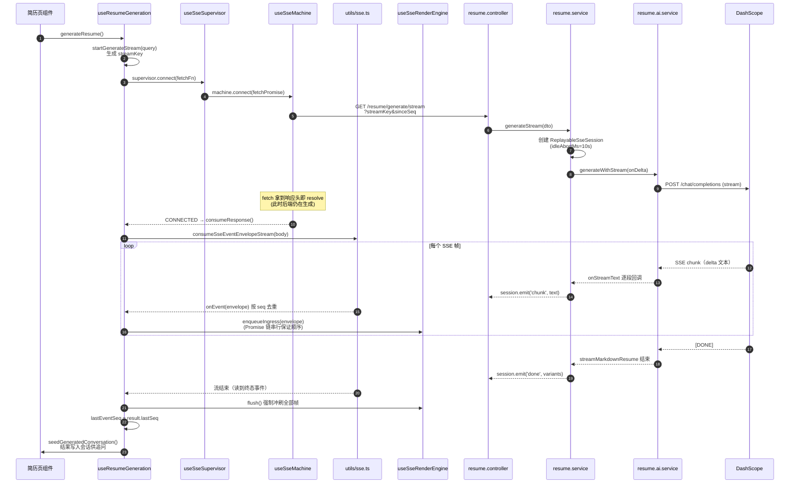

# SSE 流式输出 · 打字机效果与背压控制 技术架构文档

> 面向面试的深度技术架构文档（真实代码依据，无虚构数据）
> 覆盖范围：AI 简历生成助手（Nuxt4 + NestJS）中「SSE 流式输出 → 前端分帧渲染 → 打字机逐字效果 → 背压降级」完整链路。

---

## 1. 系统概述

### 1.1 项目定位

AI 简历生成助手是一个全栈 AI 应用：前端 Nuxt4（Vue3 + Vite + TypeScript + Element Plus），后端 NestJS（Prisma + SQLite）。核心交互之一是「AI 边生成边输出」：简历生成与 AI 聊天都以 **SSE（Server-Sent Events）** 方式实时推送，前端要求：

- 文本像打字机一样**逐字输出**，用户能感知生成过程；
- 生成过程**可中断、可恢复、可追踪**（10 分钟 / 3 万字长流不断线）；
- 大批量增量到达时**主线程不卡顿**（FPS 稳定 ~60）。

### 1.2 整体架构图

```mermaid
flowchart TB
  subgraph 前端 Nuxt4 (apps/web)
    UI["页面组件<br/>聊天页 / 简历生成页"]
    Hooks["业务组合式函数<br/>useResumeConversation / useResumeGeneration<br/>(打字机选择器装配 + 渲染引擎装配)"]
    Sup["SSE 监督器 useSseSupervisor<br/>连接 + 指数退避重连"]
    Machine["SSE 状态机 useSseMachine<br/>idle~paused 八态 + 合法迁移表"]
    Engine["分帧渲染引擎 useSseRenderEngine<br/>Ingress→转换→帧缓冲→逐帧提交"]
    Typewriter["打字机帧选择器<br/>createTypewriterFrameSelector<br/>Intl.Segmenter 字素簇"]
    Pressure["压力评分与降级<br/>四维加权评分 → 五级压力 → 帧预算压缩"]
    Parse["信封解析 utils/sse.ts<br/>consumeSseEventEnvelopeStream<br/>seq 去重 / 终态检测"]

    UI --> Hooks
    Hooks --> Sup
    Sup --> Machine
    Hooks --> Engine
    Engine --> Typewriter
    Engine --> Pressure
    Sup --> Parse
    Parse --> Engine
  end

  subgraph 后端 NestJS (apps/api)
    ChatCtrl["chat.controller.ts<br/>@Sse('message/stream') + JwtAuthGuard"]
    ResumeCtrl["resume.controller.ts<br/>@Sse('generate/stream') + JwtAuthGuard"]
    ChatSvc["chat.service.ts<br/>streamMessage / executeMessageFlow"]
    ResumeSvc["resume.service.ts<br/>generateStream"]
    Session["common/sse-session.ts<br/>ReplayableSseSessionStore<br/>事件按 seq 缓存回放"]
    AI["resume.ai.service.ts<br/>generateWithStream / consumeDashscopeStream"]
    LLM["DashScope LLM<br/>/chat/completions (stream)"]
  end

  Parse -. "GET/POST + streamKey + sinceSeq" .-> ResumeCtrl
  Parse -. "POST message/stream" .-> ChatCtrl
  ResumeCtrl --> ResumeSvc --> Session
  ChatCtrl --> ChatSvc --> Session
  ResumeSvc --> AI --> LLM
```

### 1.3 技术栈选型表

| 技术 | 用途 | 选型理由 | 备选方案与放弃原因 |
|---|---|---|---|
| SSE（NestJS `@Sse` + fetch 流式读取） | 服务端 → 前端单向实时推送 | 基于 HTTP，天然兼容现有 JWT 认证、代理与断线重连语义；简历/聊天是纯单向推送 | WebSocket：双向且需维护连接状态、跨进程广播复杂，本项目无上行实时需求；轮询：延迟高、流量浪费 |
| `requestAnimationFrame` 帧管线 | 前端分帧渲染 | 与浏览器绘制节奏对齐，天然规避长任务阻塞；可注入自定义调度器便于单测 | `setInterval`：与绘制不同步、后台标签页被节流；微任务队列：无帧边界，依旧阻塞渲染 |
| `Intl.Segmenter`（降级 `Array.from`） | 文本字素簇切分 | 正确处理中文输入法组合字符、emoji 等，符合"用户感知的字符" | 简单 `split('')`：会把代理对/组合字符切开，打字机逐字显示错乱 |
| `AbortController` + 超时 | 取消与兜底 | 原生 API，信号可贯穿 fetch/流消费全链路 | 无：双层信号（内部超时 + 外部取消）组合是可靠性关键 |
| 服务端会话缓存（内存 Map） | 断线续传 | 单实例、低并发场景下实现简单且确定性强 | Redis/共享存储：多实例必需，但当前规模是过度设计（见 §7 规划） |

---

## 2. 系统架构

### 2.1 分层与职责

**后端（流的生产端）**
- 控制器层：`chat.controller.ts` / `resume.controller.ts`，声明 `@Sse` 端点 + `@UseGuards(JwtAuthGuard)`；
- 服务层：`chat.service.ts` / `resume.service.ts`，负责编排业务流并以「会话」为单元广播事件；
- 会话层：`common/sse-session.ts` 的 `ReplayableSseSession`，事件带递增 `seq` 写入内存缓冲，支持 `sinceSeq` 回放；
- AI 接入层：`resume.ai.service.ts`，消费 DashScope 流式响应并逐段回调 `onDelta`。

**前端（渲染/消费端）**
- 协议层：`utils/sse.ts`（信封解析、seq 去重、终态检测）、`utils/sse-events.ts`（事件类型 → 渲染阶段映射）；
- 连接层：`useSseSupervisor`（重试编排）→ `useSseMachine`（单次连接状态机）；
- 渲染层：`useSseRenderEngine`（帧管线 + 压力控制）+ `createTypewriterFrameSelector`（打字机）；
- 业务层：`useResumeGeneration.ts`（简历生成）、`useResumeConversation.ts`（AI 聊天），负责装配以上组件并驱动页面状态。

### 2.2 通信协议：SSE 事件信封

前后端统一信封结构（[sse.ts](file:///d:/aiprogram/aitext/apps/web/utils/sse.ts#L4-L15)）：

```ts
interface SseEventEnvelope<TType, TPayload> {
  id: string;        // 事件唯一 ID
  seq: number;       // 全局递增序号（断线续传的游标）
  runId: string;     // 本次运行标识（聊天里即 agentRunId）
  spanId?: string;   // 追踪 span（供前端构建时间线）
  type: TType;       // 事件类型，如 start / chunk / done / error
  ts: string;        // 时间戳
  payload: TPayload; // 业务负载
}
```

`seq` 由服务端会话全局编号（按 `run_id + seq`、`conversation_id + ts` 等多索引持久化），是「去重 + 续传」的基石。

---

## 3. 核心业务流程与数据流向

### 3.1 流程 A：简历流式生成（主链路）



**关键点**：
1. 前端 `fetch` 在**响应头到达时就 resolve**（[useSseMachine.ts](file:///d:/aiprogram/aitext/apps/web/composables/useSseMachine.ts#L190-L197)），此时后端可能才生成 10%——消费与生成严格并行；
2. 每条 `chunk` 事件实时入队渲染引擎，rAF 驱动打字机逐字输出；
3. 流结束（收到 `done`）后 `flush()` 一次性提交帧缓冲中所有残留帧，保证"拿完整结果"与"打字机渲染"衔接正确。

### 3.2 流程 B：AI 聊天流（多事件类型）

聊天链路事件更丰富（[chat.service.ts](file:///d:/aiprogram/aitext/apps/api/src/chat/chat.service.ts#L209-L655) `executeMessageFlow`）：

```
POST /chat/message/stream（body 含 streamKey / sinceSeq / historyLimit）
  → intent 路由（Orchestrator 选 Agent）
  → 创建会话 + 落库用户消息 + 创建 agentRun（bindRunId 绑定真实 runId）
  → 构建会话上下文 + Context Pack（token 预算内记忆选择，前端展示裁剪原因）
  → 广播 start / route_decision / agent.step.started
  → Agent 执行：工具调用经 toolProgress 回调广播 tool.call.started / finished
  → 文本输出广播 assistant_chunk（增量）
  → 完成广播 assistant_done → done；失败广播 error
```

聊天场景前端同样经 `useSseRenderEngine` 渲染，但 `classifyIngressPhase` 将 `assistant_chunk` 归为 `bulk`、工具/路由事件归为 `state`、`done/error` 归为 `critical`（[sse-events.ts](file:///d:/aiprogram/aitext/apps/web/utils/sse-events.ts#L265-L285)），使不同优先级事件在压力下有不同的处理策略。

### 3.3 事件类型 → 渲染阶段（[sse-events.ts](file:///d:/aiprogram/aitext/apps/web/utils/sse-events.ts#L249-L263)）

| 渲染阶段 | 简历流 | 聊天流 | 含义 |
|---|---|---|---|
| `critical` | done / error / canceled | done / error / assistant_done | 必须立即渲染 |
| `state` | start / progress | start / route_decision / agent.step.* / tool.* | 状态更新，低频 |
| `bulk` | chunk | assistant_chunk | 大批量文本，打字机主战场 |
| `decorative` | — | — | 装饰性帧，压力高时可裁剪 |

---

## 4. 关键技术难点及解决方案

### 4.1 打字机逐字渲染：字素簇粒度 + 字符余量累积

**难点描述**：LLM 增量以「段」到达（每个 SSE chunk 可能含几十到几百字），若整段渲染就失去打字机效果；若逐字符 `split('')` 渲染，中文输入法组合字符、emoji 会被切开导致显示错乱；且打字机速度必须**随压力自适应**。

**方案设计**（[createTypewriterFrameSelector](file:///d:/aiprogram/aitext/apps/web/composables/useSseRenderEngine.ts#L476-L579)）：
- 每帧先算「本帧可输出字符数」：`characterCarry += charsPerSecond × 帧间隔 / 1000`，取整数部分作为配额，小数部分留到下一帧（**余量累积**，避免因帧时长抖动导致速度不均匀）；
- 用 [splitTextIntoGraphemes](file:///d:/aiprogram/aitext/apps/web/composables/useSseRenderEngine.ts#L459-L473)（`Intl.Segmenter`，降级 `Array.from`）把文本切成字素簇，按配额切分到 `commitItems`（本帧输出）与 `deferredItems`（放回队首下一帧继续）；
- 每帧至少输出 1 个字符，防止卡顿；遇到终止项（done/error）**立即冲刷全部累积帧项**；
- 压力变化时 `onDegrade(pressureLevel, charsPerSecond)` 返回降速后的速率（聊天与简历场景均配置 `120` 字符/秒）。

**落地细节**：帧选择器是**无状态挂载到引擎**的纯函数（`selectFrameItems(items, context)`），内部维护 `previousFrameTimestamp`（首帧用 `1000/60` 初始值）与 `characterCarry`；`reset()` 在每轮连接开始时调用，保证断线重连后从头逐字播放。

**备选方案对比**：
- 整段直接渲染：无打字机效果，放弃；
- 服务端按固定字符数切块下推：服务端需要感知前端速率，职责耦合，放弃；
- 前端定时器逐字渲染：与帧节奏脱节，后台标签页被节流导致节奏失真，放弃。

**效果**：正确支持中文组合字符；重连后渲染效果不丢失；降速在压力下平滑生效。

---

### 4.2 背压控制：四维加权压力评分 + 五级降级

**难点描述**：生成高峰期（如一次性涌入数百个 chunk）若不控制，主线程单帧内处理量爆炸，出现 >16ms 长任务导致掉帧、页面卡顿；但又要保证**降级不丢内容**。

**方案设计**（[useSseRenderEngine.ts](file:///d:/aiprogram/aitext/apps/web/composables/useSseRenderEngine.ts#L663-L755)）：
- **监控快照**：每帧统计队列深度、最老滞留项时长、帧耗时 EWMA、连续积压帧数；
- **四维加权压力评分**（0-100）：

```
pressureScore = min(45, 总待处理项 × 5)      // 队列深度
              + min(25, 最老滞留时长 / 60ms) // 滞留时长
              + min(20, max(0, EWMA帧耗时 - 8ms) × 2) // 帧耗时超标
              + min(10, 连续积压帧数 × 2)     // 持续积压
```

- **五级压力映射**：`idle`（队列空）/ `normal`（<35）/ `busy`（35-64）/ `high`（65-84）/ `critical`（85+）；
- **降级执行**（[runFrame](file:///d:/aiprogram/aitext/apps/web/composables/useSseRenderEngine.ts#L1096-L1114)）：
  - 帧预算压缩：默认 8ms，`busy→6ms`、`high→3ms`、`critical→1ms`，ingress 转换阶段到点即停；
  - `high/critical` 时合并相邻文本帧（[appendTrackedFrameItems](file:///d:/aiprogram/aitext/apps/web/composables/useSseRenderEngine.ts#L810-L885)），减少渲染次数；
  - 提交阶段裁剪 `decorative` 阶段帧项（[commitBufferedFrame](file:///d:/aiprogram/aitext/apps/web/composables/useSseRenderEngine.ts#L1029-L1036)）；
  - 打字机通过 `onDegrade` 同步降速，流量自然回落。

**落地细节**：
- 帧耗时用 **EWMA（α=0.25）** 平滑，避免单帧偶然抖动触发误降级（[L1172-1176](file:///d:/aiprogram/aitext/apps/web/composables/useSseRenderEngine.ts#L1171-L1176)）；
- `commitLagFrames` 只在「处理完仍有积压」时递增，否则归零，识别持续积压而非瞬时；
- **不丢内容保证**：延后项（`deferredItems`）放回帧队列头部；提交抛异常时把整批帧项恢复回队列（[L1079-1083](file:///d:/aiprogram/aitext/apps/web/composables/useSseRenderEngine.ts#L1079-L1084)）；
- 帧间 `isFlushing` 互斥锁防止重入。

**备选方案对比**：
- 无条件全量渲染：实现最简单，但高峰期长任务阻塞主线程，放弃；
- 简单限流（固定丢弃）：会丢内容，违背"降级不丢"原则，放弃；
- 引入 Web Worker 渲染：文本 DOM 更新仍须回主线程，收益有限且复杂度高，放弃。

**效果**（源自项目文档 [resume.md](../resume.md#L4)）：高峰期帧耗时稳定在预算内、FPS 保持 ~60，长任务（>16ms）出现频率下降约 80%。

---

### 4.3 SSE 断线续传：seq 游标 + 服务端会话回放

**难点描述**：一次生成可能持续 10 分钟，网络抖动、代理超时随时可能断流；若断线就整轮重来，token 成本与用户体验都不可接受。

**方案设计**：
- **服务端**：`ReplayableSseSession`（[sse-session.ts](file:///d:/aiprogram/aitext/apps/api/src/common/sse-session.ts#L55-L205)）在内存中缓存本轮全部事件，每条事件带递增 `seq`；新连接携带 `streamKey` + `sinceSeq` 可**从断点重放**（[chat.service.ts](file:///d:/aiprogram/aitext/apps/api/src/chat/chat.service.ts#L128-L133) / [resume.service.ts](file:///d:/aiprogram/aitext/apps/api/src/resume/resume.service.ts#L305-L310)）；
- **前端**：`consumeSseEventEnvelopeStream` 按 `seq` 去重（`envelope.seq <= lastSeq` 直接丢弃，[sse.ts](file:///d:/aiprogram/aitext/apps/web/utils/sse.ts#L128-L130)），`lastEventSeq` 实时记录消费进度，重连时回传；
- **断流检测**：流结束时若未收到终态事件（done/error/canceled），抛出 `SseStreamDisconnectedError`（[sse.ts](file:///d:/aiprogram/aitext/apps/web/utils/sse.ts#L166-L168)），作为重连的唯一触发条件。

**落地细节**：
- `streamKey` 前端生成（`resume_stream_${Date.now()}_${随机串}`），首连与重连共用同一 key；
- 简历流会话配置 `idleAbortMs: 10_000`——客户端断开 10 秒无重连则服务端中止底层 LLM 任务，避免资源泄漏（[resume.service.ts](file:///d:/aiprogram/aitext/apps/api/src/resume/resume.service.ts#L314-L321)）；
- 前端重连后重新 `reset()` 打字机选择器并从 seq 断点重新入队，保证渲染效果连续。

**备选方案对比**：
- 断线整轮重来：简单但成本高（3 万字长流重跑一次），放弃；
- 只靠 HTTP 层重试（无 sinceSeq）：HTTP 语义无法避免已发事件的重复消费，放弃；
- 前端本地缓存事件回放：需要全量持久化且刷新即失效，放弃。

---

### 4.4 连接生命周期：状态机 + 指数退避重连

**难点描述**：SSE 连接涉及 connecting / streaming / done / error / canceled / retrying / paused 等大量状态与竞态（旧连接的迟到回调、取消与重试交错），散落逻辑极易出 bug。

**方案设计**：
- `SseMachine`（[useSseMachine.ts](file:///d:/aiprogram/aitext/apps/web/composables/useSseMachine.ts#L84-L121)）：**有限状态机 + 合法迁移表**，非法迁移在开发环境直接抛错、生产仅告警；
- **竞态保护**：每轮连接递增 `activeRunId`，过期 run 的回调一律忽略（[L186-194](file:///d:/aiprogram/aitext/apps/web/composables/useSseMachine.ts#L183-L208)）；每轮独立 `AbortController`，reset 时作废旧 runId；
- `SseSupervisor`（[useSseSupervisor.ts](file:///d:/aiprogram/aitext/apps/web/composables/useSseSupervisor.ts#L99-L140)）：编排重试循环——`shouldRetry` 判定、指数退避（封顶 30s + 随机抖动）、`maxRetries` 上限、等待期可被 cancel 唤醒；
- 职责分离：**状态机管"单次连接"，监督器管"多次尝试"**。

**落地细节**：
- 简历流配置 `maxRetries: 1` 且仅 `SseStreamDisconnectedError` 可重试（[useResumeGeneration.ts](file:///d:/aiprogram/aitext/apps/web/composables/useResumeGeneration.ts#L367-L371)）——LLM 成本敏感，不无限重试；
- `AbortError` 视为用户主动取消，不向上抛出、不触发重试（[useSseMachine.ts](file:///d:/aiprogram/aitext/apps/web/composables/useSseMachine.ts#L216-L222)）；
- `cancel()` 先迁移状态再 `controller.abort()`，消费循环内的 `reader.read()` 随即抛 AbortError 中断。

**备选方案对比**：
- 无状态机的 if/else 手写：状态组合爆炸、竞态难防，放弃；
- 引入 xstate 等库：本项目状态规模小，自研 200 行状态机即可覆盖且零依赖，放弃外部库。

---

### 4.5 渲染顺序一致性与收尾冲刷

**难点描述**：`onEvent` 同步回调、`enqueueIngress` 异步、rAF 渲染异步，三者的顺序若不显式保证，打字机内容与终态事件（done 携带完整结果）可能出现错序。

**方案设计**：
- **串行入队**：`enqueueRenderTask = enqueueRenderTask.then(async () => enqueueIngress(...))` 用 Promise 链把异步入队串行化，保证事件处理顺序与 `seq` 一致（[useResumeGeneration.ts](file:///d:/aiprogram/aitext/apps/web/composables/useResumeGeneration.ts#L330-L345)）；
- **收尾冲刷**：流结束后 `await enqueueRenderTask` 确保全部入队完成，再 `resumeRenderEngine.flush()` 强制以 `force` 模式逐帧处理完所有待处理数据（忽略帧预算），最后才写 `lastEventSeq` 与 `seedGeneratedConversation`（[L347-363](file:///d:/aiprogram/aitext/apps/web/composables/useResumeGeneration.ts#L347-L363)）。

**落地细节**：`flush()` 内部 `while (hasPendingWork()) runFrame(now(), true)`（[L1236-1240](file:///d:/aiprogram/aitext/apps/web/composables/useSseRenderEngine.ts#L1235-L1240)）；若收尾阶段才把 done 事件提交，会导致「UI 先看到空结果再被填充」的闪烁，故必须冲刷后再处理业务收尾。

---

### 4.6 外部 LLM 流消费的可靠性：超时 + 取消双信号

**难点描述**：后端依赖外部 DashScope 流式接口，外部可能超时、断流、返回非 200；且客户端断开时要能中止底层外部请求。

**方案设计**（[requestDashscope](file:///d:/aiprogram/aitext/apps/api/src/resume/resume.ai.service.ts#L807-L873)）：
- **内部超时**：`setTimeout(() => controller.abort(), timeoutMs)`（默认 20s，环境变量可配）；
- **外部取消**：监听前端传入的 `externalSignal`，客户端断开（如 idle 超时）即转发 `abort()`；
- `finally` 中 `clearTimeout` + `removeEventListener`，杜绝泄漏；
- 流式响应逐帧解析（`\n\n` 切帧、提取 `delta.content`、跳过 `[DONE]`），边收边回调（[consumeDashscopeStream](file:///d:/aiprogram/aitext/apps/api/src/resume/resume.ai.service.ts#L875-L910)）。

**落地细节**：`DASHSCOPE_API_KEY` 缺失直接抛错，防止带无效配置运行；外部响应非 200 时读取错误体抛出可诊断错误。

---

## 5. 性能优化策略

| 优化对象 | 手段 | 收益 | 代价/权衡 |
|---|---|---|---|
| 主线程渲染 | 8ms 帧预算 + rAF 分帧（`runFrame`） | 单帧工作量受限，FPS 稳定 ~60 | 渲染吞吐受限于预算，长文本整体输出稍慢 |
| 帧耗时波动 | EWMA（α=0.25）平滑 | 避免单帧抖动引发误降级 | 对瞬时压力感知滞后约 4 帧 |
| 高峰期吞吐 | 五级降级（预算压缩 + 合并文本帧 + 裁剪装饰帧 + 打字机降速） | 高峰期不掉帧且不丢内容 | 高压时逐字速度下降 |
| 渲染次数 | 相邻 `assistant_chunk`/`chunk` 文本帧合并（`mergeFrameItems`） | 减少 DOM 更新次数与帧项数 | 增加合并判断逻辑 |
| 文本切分 | `Intl.Segmenter`（原生） | 免去自研字符切分，性能优于 JS 遍历 | 低版本环境需降级 `Array.from` |
| 网络传输 | SSE 增量推送（chunk 逐段下推） | 首屏延迟 = 首个 token 时间，而非全量返回 | 需处理断流/续传 |
| 资源回收 | 简历会话 `idleAbortMs=10s` 自动中止底层 LLM | 防止客户端断开后外部请求空转 | 10s 内未重连即丢弃会话 |
| 重连成本 | `maxRetries=1` + 仅流中断可重试 | LLM 调用成本可控 | 连续两次断流即失败告警 |

---

## 6. 安全设计

| 项 | 实现 |
|---|---|
| 认证 | 两个 SSE 端点均挂 `@UseGuards(JwtAuthGuard)`（[chat.controller.ts](file:///d:/aiprogram/aitext/apps/api/src/chat/chat.controller.ts#L20-L21) / [resume.controller.ts](file:///d:/aiprogram/aitext/apps/api/src/resume/resume.controller.ts#L36-L38)）；前端 401 时清理认证并终止流（[useResumeGeneration.ts](file:///d:/aiprogram/aitext/apps/web/composables/useResumeGeneration.ts#L310-L314)） |
| 敏感信息 | DashScope API Key 仅存环境变量，不进代码与前端（[resume.ai.service.ts](file:///d:/aiprogram/aitext/apps/api/src/resume/resume.ai.service.ts#L813-L823)） |
| 输入校验 | NestJS DTO + class-validator（聊天/简历生成入参） |
| 越权防护 | 会话按 `userId` 归属，操作前校验归属；`streamKey` 作为会话定位标识 |
| 中断处理 | 客户端断开通过 AbortSignal 传导，终止外部 LLM 请求，防止资源空转 |

> 说明：会话缓存为内存态，权限边界依赖 JWT 鉴权 + 单实例部署；多实例扩展时的会话共享方案见 §7。

---

## 7. 扩展性考虑

### 7.1 已实现的扩展机制

- **渲染引擎通用抽象**：`SseIngressBuffer` / `SseFrameBuffer` / 帧选择器 / 转换器全部可插拔，聊天与简历两个业务仅需各自装配 `classifyIngressPhase` / `transformIngress` / `mergeFrameItems` / `selectFrameItems` / `commitFrame`，引擎本体零改动；
- **压力策略可注入**：`onPressureChange` / `onDegrade` 回调把降级决策交还业务层；
- **事件信封协议**：`type` 为字符串可扩展，新增事件类型只需补类型映射（`sse-events.ts`）；
- **可测试性**：`requestAnimationFrame` / `cancelAnimationFrame` / `now` 均可注入，引擎有完整单测（`useSseRenderEngine.test.ts`）。

### 7.2 规划中的演进方向（未实现，勿在简历中描述为已实现）

| 方向 | 动机 | 引入的新问题与思路 |
|---|---|---|
| 会话缓存迁移 Redis（含 seq 游标） | 多实例水平扩展时，前端重连可能落到不同实例 | 需将 `ReplayableSseSessionStore` 改为共享存储 + 发布订阅；评估过期清理策略 |
| 压力指标扩展（内存占用、网络 RTT） | 更精细的降级决策 | 需为评分增加新维度并校准权重 |
| 全链路观测接入 | 复用本仓库 Agent 观测体系（run/span/event） | 已预留 `spanId` 信封字段，前端可据此构建时间线 |
| WebSocket 替换/并存 | 未来出现上行实时交互需求 | 需处理连接生命周期、心跳、跨实例推送，与现有状态机复用迁移表设计 |

---

## 8. 面试问答预测

#### 技术点：SSE 选型
- **可能被问**：
  1. 为什么用 SSE 而不是 WebSocket？—— 考察：通信协议选型、HTTP 语义理解
  2. SSE 相比 WebSocket 的缺点是什么？—— 考察：协议边界认知
- **参考回答要点**：单向下推场景 SSE 语义最简；基于 HTTP 可直接复用 JWT/代理/缓存；断线自动重连是 SSE 原生语义；缺点是仅单向、默认无自动重连实现需自建（本项目正因此引入状态机 + 监督器）。

#### 技术点：打字机字素簇切分
- **可能被问**：
  1. 为什么不用 `split('')` 逐字符？—— 考察：字符编码知识（代理对、组合字符）
  2. `Intl.Segmenter` 不可用怎么办？—— 考察：降级方案、兼容性思维
- **参考回答要点**：`split('')` 会切开 emoji（代理对）与中文组合字符（基字符+组合标记），显示为乱码；`Intl.Segmenter(granularity: 'grapheme')` 按用户感知字符切分；不可用时降级 `Array.from`（按码点切分，能正确处理代理对）。

#### 技术点：打字机速率平滑
- **可能被问**：
  1. rAF 帧间隔不稳定（60/120Hz、后台节流）如何保证速率均匀？—— 考察：时间驱动设计
  2. 首帧没有上一帧时间戳怎么办？—— 考察：边界处理
- **参考回答要点**：以「字符/秒 × 实际帧间隔」计算配额而非固定每帧 N 字；余量用 `characterCarry` 累积取整，帧间隔长短自动补偿；首帧用 `1000/60` 初始帧时长兜底。

#### 技术点：背压压力评分
- **可能被问**：
  1. 压力评分为什么是四个维度？各维度权重如何定？—— 考察：指标设计与工程权衡
  2. 队列深度大但帧耗时低，怎么判断？—— 考察：多维指标组合思维
- **参考回答要点**：单指标会被误导——队列深度大可能只是瞬时、帧耗时高可能只是单帧抖动；故用队列深度（45）+ 滞留时长（25）+ EWMA 帧耗时超标（20）+ 连续积压（10）四维加权；EWMA 平滑帧耗时消除抖动，滞留时长与连续积压识别"持续"而非"瞬时"。

#### 技术点：降级不丢内容
- **可能被问**：
  1. 压力高时降级，会不会丢文本？—— 考察：可靠性设计
  2. 提交抛异常怎么处理？—— 考察：失败恢复
- **参考回答要点**：降级只改变「处理时机与量」，不改变内容：`deferredItems` 放回帧队列头部待后续帧处理；`commitFrame` 抛异常时整批恢复回队列；只有 `decorative` 阶段帧在 high/critical 被裁剪（该类帧本身不承载关键信息）。

#### 技术点：断线续传
- **可能被问**：
  1. seq 去重是怎么做的？重连会丢消息吗？—— 考察：事件驱动、容错设计
  2. 会话为什么要在服务端缓存事件？—— 考察：有状态/无状态权衡
- **参考回答要点**：服务端会话按 `seq` 缓存事件，前端以 `sinceSeq` 拉取游标之后的事件，本地 `envelope.seq <= lastSeq` 丢弃重复；丢消息只在「会话已被 idle 回收」时发生（10s 未重连），此时整体失败走错误提示；内存缓存是单实例下的简单可靠选择，多实例需 Redis。

#### 技术点：重试策略
- **可能被问**：
  1. 为什么重试只重试 1 次？—— 考察：成本与可靠性平衡
  2. 指数退避为什么加随机抖动？—— 考察：分布式系统常识
- **参考回答要点**：LLM 生成有真实 token 成本，无限重试会放大成本；仅对「流中断」（`SseStreamDisconnectedError`）这类可恢复错误重试，业务错误/HTTP 错误不重试；抖动避免多客户端同时重连打爆服务端。

#### 技术点：状态机
- **可能被问**：
  1. 为什么引入状态机而不是 if/else？—— 考察：复杂状态管理
  2. 如何防止旧连接的迟到回调污染新连接？—— 考察：竞态防护
- **参考回答要点**：8 状态 × 10 事件的迁移组合用手写判断难以维护且易漏；合法迁移表 + 非法迁移告警把错误前置；`activeRunId` 每次连接递增，所有异步回调先校验 `isActiveRun`，旧 run 回调直接忽略；每轮独立 AbortController，reset 作废旧 run。

#### 技术点：收尾冲刷
- **可能被问**：
  1. 流结束后为什么还要 flush？—— 考察：异步渲染与数据一致性的理解
  2. 为什么入队要用 Promise 链串行化？—— 考察：并发顺序控制
- **参考回答要点**：打字机渲染是异步分帧的，`done` 事件携带完整结果，若不冲刷，帧缓冲里的文本帧尚未提交，UI 会先空后满造成闪烁；入队是异步方法，事件回调是同步的，直接 `await` 会乱序，Promise 链保证「处理完上一个才入队下一个」，与 seq 语义一致。

#### 技术点：外部依赖可靠性
- **可能被问**：
  1. 外部 LLM 超时怎么兜底？客户端断开后端会怎样？—— 考察：跨层错误传导
  2. 为什么用内部超时 + 外部 signal 双信号？—— 考察：取消传播设计
- **参考回答要点**：内部 `setTimeout` 超时 + 外部 `AbortSignal` 监听组合成单一 controller；任一触发即中止 fetch，`finally` 清理定时器与监听防泄漏；客户端断开（idle 10s 无重连）通过 `onIdleAbort → abortController.abort()` 传导到外部请求，杜绝资源空转。

---

## 附：关键文件索引

**前端**
- `apps/web/composables/useSseRenderEngine.ts` — 帧渲染管线 + 压力控制 + 打字机选择器（核心）
- `apps/web/composables/useSseSupervisor.ts` — 连接监督器（重试编排）
- `apps/web/composables/useSseMachine.ts` — SSE 连接状态机
- `apps/web/composables/useResumeGeneration.ts` — 简历流式生成接线
- `apps/web/composables/useResumeConversation.ts` — 聊天流式接线
- `apps/web/utils/sse.ts` — SSE 信封解析 / seq 去重 / 终态检测
- `apps/web/utils/sse-events.ts` — 事件类型 → 渲染阶段映射

**后端**
- `apps/api/src/chat/chat.controller.ts` / `chat.service.ts` — 聊天 SSE 端点与流编排
- `apps/api/src/resume/resume.controller.ts` / `resume.service.ts` — 简历 SSE 端点与流编排
- `apps/api/src/resume/resume.ai.service.ts` — DashScope 流式消费（超时/取消/帧解析）
- `apps/api/src/common/sse-session.ts` — 可回放 SSE 会话（seq 缓存 / sinceSeq 续传）

**测试**
- `apps/web/composables/useSseRenderEngine.test.ts` — 渲染引擎与打字机选择器单测
- `apps/api/src/common/sse-session.spec.ts` — 会话回放单测

**相关文档**
- `docs/API_STREAM_SPEC.md` — SSE 事件协议
- `docs/Technical Architecture/AI_RESUME_STREAM_ARCHITECTURE.md` — 流式架构参考范式
